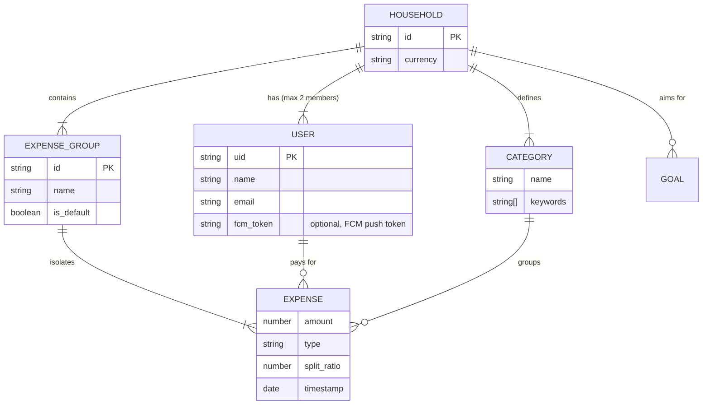

# AGENT INSTRUCTIONS: Secure Household Expense Tracker & Analytics PWA
**Agent Directive:** You are an expert Next.js, Firebase, and Progressive Web App (PWA) engineer. Read this entire document to understand the High-Level Design (HLD), Low-Level Design (LLD), database architecture, automated ingestion pipelines, exhaustive validations, and testing requirements before writing any code. Execute the development sequentially according to the Execution Plan at the bottom.
---
## 1. Project Overview & Tech Stack
A lightweight, mobile-first PWA for couples to track shared and solo expenses, automate debt settlement, and visualize month-over-month spending trends. It uses Firebase Authentication, segments expenses into contextual "Expense Groups" (e.g., "Day to day" vs. "Goa Trip"), and features robust offline persistence for logging expenses without network connectivity.
* **Frontend:** Next.js (App Router), React, TailwindCSS, shadcn/ui
* **State & Offline Sync:** Zustand (Client State), `next-pwa` (Service Worker + IndexedDB)
* **Backend & Database:** Firebase Auth, Firestore (NoSQL), Firebase Client SDK
* **Data Visualization:** Recharts (SVG/Canvas charts)
* **Testing:** Playwright (E2E)
---
## 2. System Architecture (HLD)
The system relies on a local-first approach using Firebase's IndexedDB persistence, syncing to the cloud when online. It also features a backend webhook for automated email receipt ingestion.
```mermaid
graph TD
    subgraph Client Device (PWA)
        UI[Next.js App Interface]
        Worker[Service Worker]
        OfflineDB[(IndexedDB Local Cache)]
    end
    subgraph Firebase Cloud
        Auth[Firebase Authentication]
        CloudDB[(Firestore NoSQL)]
    end
    subgraph Automated Ingestion Pipeline
        SES[Amazon SES Email Receiver]
        Webhook[Next.js API Webhook]
    end
    subgraph Push Notification Pipeline
        PushAPI[Next.js API: /api/notifications/send]
        AdminSDK[Firebase Admin SDK]
        FCM[Firebase Cloud Messaging]
    end
    UI <-->|Authenticates| Auth
    UI <-->|Reads/Writes Data| Worker
    Worker <-->|Caches for Offline| OfflineDB
    Worker <-->|Background Sync| CloudDB
    SES -->|Forwards Parsed Receipt| Webhook
    Webhook -->|Direct DB Write| CloudDB
    UI -->|After mutation| PushAPI
    PushAPI -->|Reads partner token| AdminSDK
    AdminSDK -->|Sends push| FCM
    FCM -->|Delivers to partner| Worker
```
---
## 3. Database Architecture & Schemas (LLD)
### 3.1 Entity Relationship Diagram


### 3.2 Firestore NoSQL Structure
All operational data is siloed under the root `households` collection to strictly partition data via Firebase Security Rules.
* `households` (Collection) -> Auto-ID (Document)
    * `currency`: string (default `"INR"`)
    * `created_at`: timestamp
    * `members`: string[] (Array of Firebase Auth UIDs, max length 2)
    * `categories` (Subcollection) -> `name`: string, `keywords`: string[]
    * `groups` (Subcollection) -> `name`: string, `is_default`: boolean
    * `goals` (Subcollection) -> `name`: string, `target_amount`: number, `current_amount`: number
    * `expenses` (Subcollection)
        * `amount`: number
        * `description`: string
        * `group_id`: string (References Doc ID in `groups`)
        * `category_id`: string (References Doc ID in `categories`)
        * `expense_type`: enum (`"solo"`, `"joint"`, `"settlement"`)
        * `paid_by_user_id`: string (References Auth UID)
        * `split_ratio`: number (default `0.50`)
        * `date`: timestamp
        * `source`: enum (`"manual"`, `"email"`, `"sms"`)

### 3.3 Default Database Initialization (Seed Data)
Upon Household creation, the database MUST be seeded with the following defaults:

**Default Groups:**
1. `name: "Day to day"`, `is_default: true`
2. `name: "Annual expenses"`, `is_default: false`

**Default Categories (JSON Map):**
```json
[
  { "name": "Housing & Utilities", "keywords": ["rent", "mortgage", "electricity", "water", "internet", "maintenance", "jio", "airtel", "bescom", "gas"] },
  { "name": "Groceries", "keywords": ["blinkit", "zepto", "instamart", "dmart", "bigbasket", "supermarket", "grocery"] },
  { "name": "Food & Dining", "keywords": ["swiggy", "zomato", "restaurant", "cafe", "mcdonalds", "kfc", "starbucks", "dominos", "bar", "pub"] },
  { "name": "Transportation", "keywords": ["uber", "ola", "petrol", "shell", "parking", "toll", "fastag", "metro", "flight", "train"] },
  { "name": "Shopping & Lifestyle", "keywords": ["amazon", "flipkart", "myntra", "zara", "clothing", "electronics", "nykaa", "salon"] },
  { "name": "Health & Wellness", "keywords": ["pharmacy", "apollo", "doctor", "hospital", "gym", "cult", "fitness", "medicine"] },
  { "name": "Entertainment & Subs", "keywords": ["netflix", "spotify", "prime", "hotstar", "movie", "bookmyshow", "pvr", "concert"] },
  { "name": "Miscellaneous", "keywords": ["gift", "donation", "cash", "atm", "fee", "penalty"] }
]
```
---
## 4. User Journeys & Core Logic
### 4.1 Authentication & Onboarding Flow
1. **Sign Up/Login:** Users authenticate via Email/Password or Google OAuth.
2. **Household Creation:** User clicks "Create Household". App generates Household Doc, adds User UID to `members`, seeds default categories/groups, and generates an Invite Link (`/invite/[code]`).
3. **Household Join:** Partner accesses Invite Link, logs in, and their UID is appended to the `members` array. Max capacity enforced (2 members).

### 4.2 Context Switching (Expense Groups)
* **The Global Toggle:** A prominent top-nav dropdown allows users to switch the active Expense Group (defaults to "Day to day").
* **Data Isolation:** Changing the active group immediately filters the visible expenses list, the settlement math, and the analytics charts to ONLY show data matching the active `group_id`. All tabs (Dashboard, Expenses, Analytics) derive their group context from the global `activeGroup` in the Zustand store — no tab maintains its own independent group filter.

### 4.3 Smart Categorization Engine
1. **Sanitize:** `description.toLowerCase().trim()`.
2. **Match:** Search active household's categories. If input string matches or includes any string in a category's `keywords` array, auto-assign that `category_id`.
3. **Learn:** If no match, prompt user to select manually via UI. Upon selection, execute Firestore `arrayUnion()` to permanently append the sanitized input to that category's `keywords` array.

### 4.4 Settlement Mathematics
Calculated dynamically based strictly on the active Expense Group:

> **Net Balance User A** = `Sum(Joint Expenses Paid By A * Partner's Split Ratio)` - `Sum(Joint Expenses Paid By B * User A's Split Ratio)`

* If Net Balance A > 0, User B owes User A.
* If Net Balance A < 0, User A owes User B.
* Solo expenses are mathematically ignored.
* `'Settlement'` type expenses natively reduce the owed balance.

### 4.5 Spend Analytics
Requires a dedicated dashboard view querying the last 6 months of active group data. Analytics always reflects the globally selected expense group (no independent group selector).
1. **Trend Line Chart:** Multi-line charting total monthly spend, User A solo spend, and User B solo spend.
2. **Category MoM Bar Chart:** Stacked bar chart comparing the current month's category totals against the previous month to highlight variance. When mid-month, the "This Month" bar displays a **projected full-month value** (current spend / month progress) for fair comparison, with a "(Projected)" label in the legend and actual spend shown in the tooltip. Early in the month (days 1–5), no projection is applied.
3. **Insights Engine:** Auto-generated spending insights that use projected values for all month-over-month comparisons (increase, decrease, steady, total change) to avoid unfair partial-month vs full-month comparisons.
4. **Chart Layout:** All bar charts use a minimum 25px bottom margin and 12px legend padding to prevent bar values from overlapping with legend text.

### 4.6 Push Notifications (Partner Activity Alerts)
Real-time push notifications inform partners when the other person creates or edits an expense, or records a settlement.

**Architecture:**
```
User A creates/edits expense or records settlement
  → Firestore write (existing client-side)
  → Client calls POST /api/notifications/send (fire-and-forget)
    → Next.js API route uses Firebase Admin SDK to:
        1. Look up partner UID from household.members
        2. Fetch partner's fcm_token from users/{uid}
        3. Send FCM message to partner's device
  → Partner receives:
      - Background (app closed/minimized): native browser push notification via service worker
      - Foreground (app open): Sonner toast via useForegroundNotifications hook
```

**Key files:**
* `lib/firebase/admin.ts` — Firebase Admin SDK singleton (server-side only, uses base64-encoded service account from `FIREBASE_ADMIN_SERVICE_ACCOUNT_KEY` env var)
* `app/api/notifications/send/route.ts` — POST endpoint that validates payload, resolves partner, fetches FCM token, sends via Admin SDK
* `lib/notifications/buildNotificationPayload.ts` — Pure functions to build human-readable notification strings (testable independently)
* `lib/notifications/sendPushNotification.ts` — Client-side fire-and-forget wrapper that calls the API route
* `hooks/useForegroundNotifications.ts` — Mounts `onForegroundMessage()` listener, shows Sonner toast; mounted in `AuthGuard.tsx`
* `lib/firebase/messaging.ts` — Client-side FCM token management (request permission, save/remove token, foreground listener)
* `public/firebase-messaging-sw.js` — Background push notification handler + notification click navigation
* `components/settings/NotificationSettings.tsx` — UI toggle for enabling/disabling push notifications

**Notification payloads:**
* New expense: `"Shivam added: Swiggy dinner — ₹500 (Joint · Your share: ₹250)"`
* Updated expense: `"Shivam updated: Swiggy dinner — ₹600"`
* Settlement: `"Shivam recorded a settlement of ₹2,500"`

**User opt-in:** Settings → Push Notifications toggle. FCM token stored on user doc as `fcm_token` field. API route returns 200 gracefully when partner has no token (notifications disabled).

**Environment setup required:**
* `NEXT_PUBLIC_FIREBASE_VAPID_KEY` — generated in Firebase Console → Cloud Messaging → Web Push certificates
* `FIREBASE_ADMIN_SERVICE_ACCOUNT_KEY` — base64-encoded service account JSON from Firebase Console → Project Settings → Service accounts
---
## 5. Exhaustive Validations
All forms must enforce these strict rules before triggering a database write:
* **Amount:** Numeric only, > 0, max `99,999,999.00`. (Negative numbers allowed ONLY for explicitly categorized refunds/returns).
* **Description:** Max 100 characters. No leading/trailing spaces. Sanitized against HTML/JS injection.
* **Split Ratios:** The sum of User A + User B share must exactly equal `1.00` (100%).
* **Dates:** Disallow future dates. Default to `new Date()`.
* **Names (Groups/Categories):** Max 30 characters. Must be unique within the household.
---
## 6. Playwright Automation Test Suites
### Suite A: Authentication & Access
1. **Unauthenticated Redirect:** Navigating directly to `/dashboard` redirects to `/login`.
2. **Household Capacity:** Joining a Household with 2 existing members returns a "Household full" error.
3. **Invite Expiration:** Accessing an expired/invalid `/invite/[code]` shows explicit error UI.

### Suite B: Expense Form Validations (Negative Testing)
1. **Empty Submit:** Clicking save with empty fields highlights missing inputs in red; blocks submission.
2. **Type Mismatch:** Pasting "Text" into the Amount field is blocked.
3. **Future Date:** Selecting tomorrow's date throws validation error.
4. **XSS Protection:** Submitting `<script>alert('hack')</script>` saves securely and renders as raw text in the DOM.

### Suite C: Settlement Math (Core Integrity)
1. **Symmetrical:** User A logs ₹1000 Joint (50/50). Assert ledger reads "User B owes User A ₹500".
2. **Asymmetrical:** User B logs ₹2000 Joint (80/20, B's share 80%). Assert ledger reads "User A owes User B ₹400".
3. **Bidirectional Offset:** User A is owed ₹500. User B logs ₹600 Joint (50/50). Assert ledger reads "User A owes User B ₹200".
4. **Refunds:** User B owes ₹500. User A logs a -₹1000 Joint expense. Assert debt reverses to "User A owes User B ₹500".

### Suite D: Group Context Isolation
1. **Data Segregation:** Log ₹500 in "Day to day". Switch active group to "Annual expenses". Assert expense disappears and ledger reads ₹0.
2. **State Bleed:** Toggle rapidly between groups. Assert Zustand state strictly adheres to active `group_id` without merging data.
3. **Analytics Group Sync:** Switching global group via GroupSwitcher immediately updates the analytics page header, charts, and insights to reflect the new group. No independent analytics group filter exists.

### Suite E-PN: Push Notification Infrastructure
1. **API Validation:** POST `/api/notifications/send` with empty body returns 400 with "Missing required fields".
2. **API Partial Payload:** Omitting `title` or `sender_uid` returns 400.
3. **Settings UI:** Notification settings card and push toggle render on Settings page.
4. **No Regression — Expense Form:** Expense form opens, validates, and submits correctly with notification triggers wired in.
5. **No Regression — Settlement:** Dashboard loads and settlement card renders correctly with notification triggers wired in.
6. **Foreground Hook:** App loads without runtime errors after mounting `useForegroundNotifications` in AuthGuard.
7. **Service Worker:** `GET /firebase-messaging-sw.js` returns 200 and contains hardcoded Firebase config + `onBackgroundMessage`.
8. **Payload Builders (Unit):** `buildExpenseCreatedPayload` includes partner share for joint, marks solo correctly, handles non-equal splits, and works with multiple currencies. `buildSettlementPayload` formats settlement amounts correctly.

### Suite E: Offline PWA Functionality
1. **Offline Read:** Disable network. Reload page. Assert app shell and cached IndexedDB expenses render correctly.
2. **Offline Write:** Disable network. Log ₹300 expense. Assert optimistic UI update with "Pending Sync" indicator.
3. **Background Sync:** Re-enable network. Assert "Pending Sync" resolves and Firestore `onSnapshot` confirms remote write.
---
## 7. Execution Plan & Deployment Gates
### Execution Sequence:
* **Phase 1:** Init Next.js, `next-pwa`, Tailwind, shadcn/ui. Set up Firebase Auth and protected routes.
* **Phase 2:** Build Onboarding flow (Create/Join Household) and Firestore initialization script (seed JSON data).
* **Phase 3:** Build Dashboard, Group Switcher (Zustand state), and Expense Entry Form (with validations).
* **Phase 4:** Implement Smart Categorization algorithms and Settlement Math utility functions.
* **Phase 5:** Build Recharts Analytics dashboard.
* **Phase 6:** Scaffold `/api/ingest/email` webhook and write Playwright E2E tests.
* **Phase 7:** Push notifications — Firebase Admin SDK, API route `/api/notifications/send`, notification payload builders, foreground toast hook, service worker config fix, and trigger wiring in ExpenseForm + SettlementCard.

### Deployment Success Gates (CI/CD):
1. 100/100 Google Lighthouse PWA score.
2. 100% Playwright Test Pass Rate.
3. Zero TypeScript or ESLint errors.
